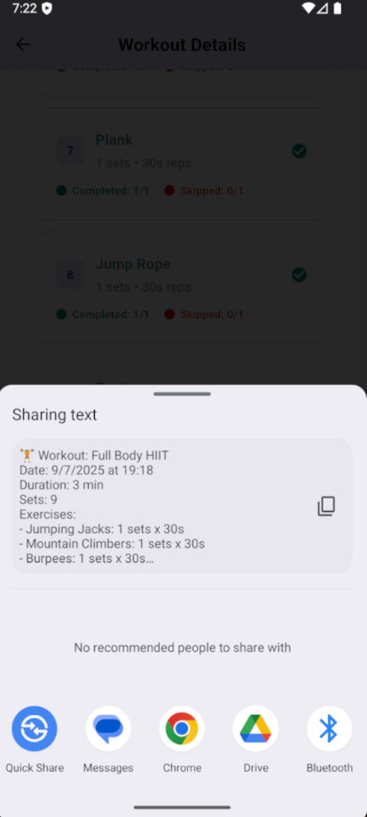
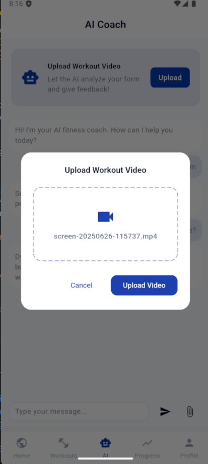
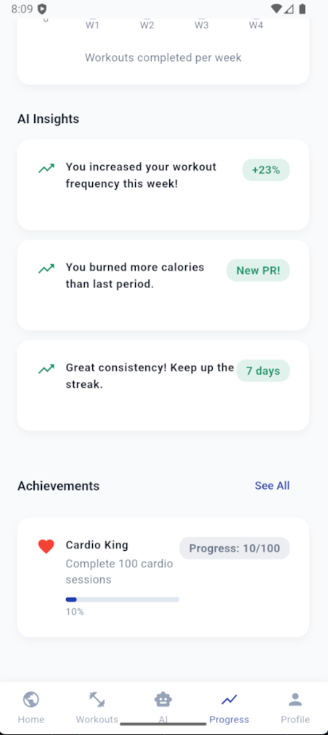
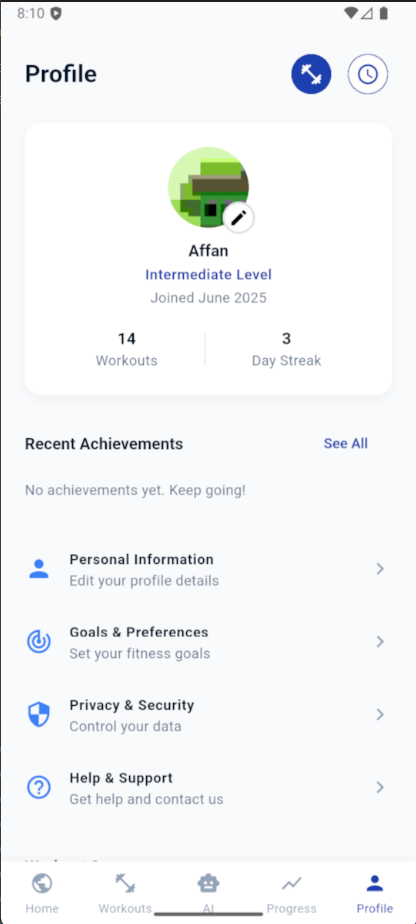

# OptiFit: AI-Powered Fitness App

## Overview
OptiFit is a cross-platform fitness app built with Flutter, featuring AI-powered workout analysis, dynamic achievements, and a modern, user-friendly UI. The backend is a Python (Flask) service, deployed on Railway, handling video uploads and AI analysis asynchronously.

## Key Features
- **AI Video Analysis:** Upload workout videos for real-time AI feedback and form analysis.
- **Dynamic Achievements:** Earn achievements based on workout streaks, cardio sessions, and more.
- **Personalized Insights:** AI-generated fitness insights and recommendations.
- **Profile & Progress Tracking:** View and edit personal info, set goals, track progress, and manage privacy.
- **Help & Support:** In-app FAQ and contact form.

## Screenshots

| Section   | Screenshots                                                                                                                                       |
|----------|----------------------------------------------------------------------------------------------------------------------------------------------------|
| **Home**    |                                                                                                                      |
| **Workouts** |                                                       |
| **AI Chat**  |                                                                                      |
| **Progress** |                                                                                      |
| **Profile**  |                                                                                                                      |

## Design & Architecture
- **Frontend:** Flutter (Dart)
  - Modular structure: `lib/screens/`, `lib/models/`, `lib/services/`, `lib/widgets/`, `lib/theme/`
  - State management: Local state (setState), with service classes for data persistence (see `DataService`)
  - Async UI: All network and heavy operations are async, with loading indicators and error handling
  - Consistent UI: Uses `AppTheme` for colors, padding, and card styles
  - Snackbars: All save/notify actions use a top-of-screen, green, auto-dismiss snackbar for consistency
  - Profile images: Always use `assets/profile.png` as the default/fallback
- **Backend:** Python (Flask, Railway)
  - Async video upload and polling for AI analysis results
  - Endpoints: `/upload`, `/result/<job_id>`, etc.
  - Returns JSON responses for easy integration

## Directory Structure
```
OptiFit/
  ├── lib/
  │   ├── models/         # Data models (e.g., workout, user)
  │   ├── screens/        # All UI screens (profile, home, settings, etc.)
  │   ├── services/       # Data and backend service classes
  │   ├── theme/          # App-wide theme and style constants
  │   ├── widgets/        # Reusable UI widgets
  │   └── utils/          # Utility functions
  ├── assets/             # Images (profile.png, applogo.png, screenshots, etc.)
  ├── android/ ios/ ...   # Platform-specific code
  ├── pubspec.yaml        # Flutter dependencies
  ├── README.md           # This file
  └── ...
```

## Naming Conventions
- **Files:**
  - Screens: `screen_name_screen.dart` (e.g., `profile_screen.dart`)
  - Models: `model_name.dart` (e.g., `workout_models.dart`)
  - Widgets: `widget_name.dart`
- **Classes:**
  - `PascalCase` for classes (e.g., `ProfileScreen`)
  - `camelCase` for variables and methods
- **State Management:**
  - Use `StatefulWidget` for screens with dynamic content
  - Use service classes (e.g., `DataService`) for data persistence and business logic

## UI/UX Conventions
- **Theme:** All colors, padding, and radii are defined in `lib/theme/theme.dart` via `AppTheme`.
- **Snackbars:**
  - Use a green, top-of-screen, floating snackbar for all save/notify actions
  - No action button; auto-dismiss after 2 seconds
- **Profile Images:**
  - Use `assets/profile.png` as the default everywhere
  - User-uploaded images are shown if available, else fallback to the asset
- **FAQ:**
  - Use `ExpansionTile` for FAQ in Help & Support
- **Navigation:**
  - After saving or sending, auto-navigate back after snackbar dismisses

## Setup & Running
1. **Clone the repo:**
   ```
   git clone https://github.com/MasterAffan/OptiFit.git
   cd OptiFit
   ```
2. **Install dependencies:**
   ```
   flutter pub get
   ```
3. **Add assets:**
   - Ensure `assets/profile.png`, `assets/applogo.png`, and screenshots in `assets/screenshots/` are present
   - Check `pubspec.yaml` for asset registration
4. **Run the app:**
   ```
   flutter run
   ```
5. **Backend:**
   - The backend is a Python Flask app (see backend repo or `/upload` endpoint)
   - Update API URLs in the app if backend location changes

## Contribution & Extension
- Follow the existing file and naming conventions
- Use the provided service classes for new data features
- Keep UI/UX consistent with the theme and snackbar style
- For new screens, use the same modular structure and navigation patterns
- Add new assets to the `assets/` folder and register in `pubspec.yaml`

## Special Notes for Developers
- The project is modular and easy to extend—follow the directory and naming conventions
- All async actions use top-of-screen snackbars for feedback
- Profile images are always local assets unless user uploads a new one
- FAQ and support are handled via `ExpansionTile` and in-app forms
- State is managed locally or via service classes; no external state management library is used
- For backend integration, see `lib/services/data_service.dart`

