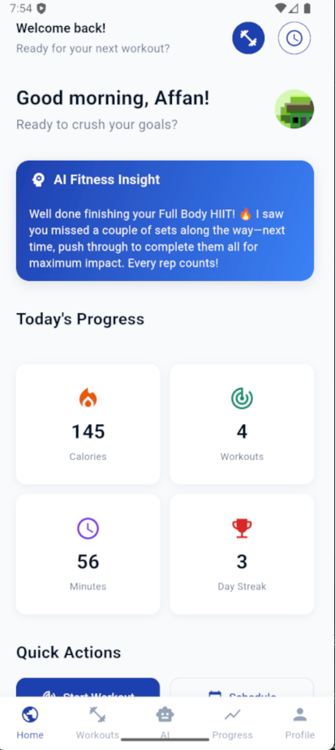
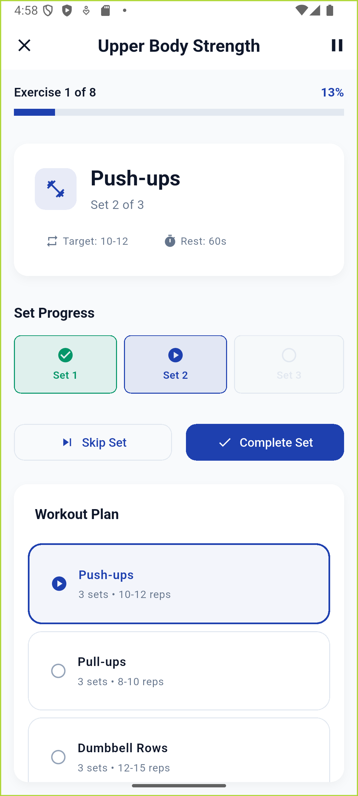
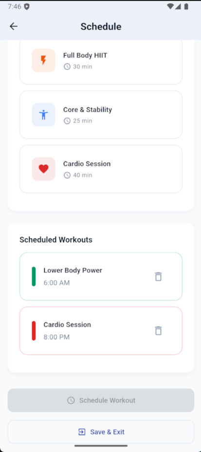
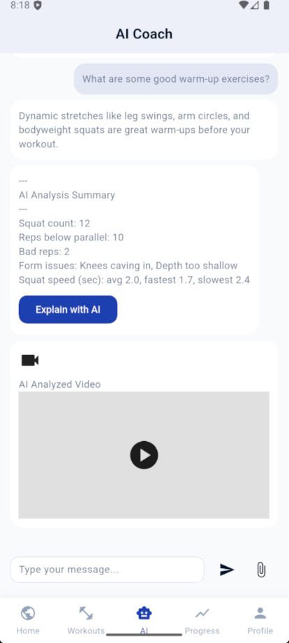
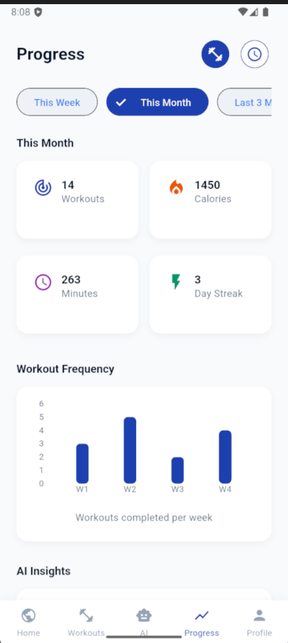

# OptiFit Frontend

This is the frontend for the OptiFit application, a Flutter-based mobile app for Android and iOS. It provides a user-friendly interface for tracking workouts, getting AI-powered feedback, and monitoring progress.

## Features

- **Workout Tracking:** Record your exercises and view your workout history.
- **AI Form Analysis:** Upload a video of your squat and receive real-time feedback on your form.
- **AI Chat:** Interact with an AI assistant to get personalized fitness advice.
- **Progress Visualization:** Track your progress with intuitive charts and graphs.
- **User Profile:** Manage your profile and settings.

## Screenshots

  
  
  
  
   
  
  
  
  

## Architecture

The app is built using the Flutter framework and follows a standard project structure. Key architectural patterns include:

- **State Management:** (Describe the state management solution used, e.g., Provider, BLoC, Riverpod).
- **Service-Based Architecture:** Services are used to encapsulate business logic and interact with the backend API.
- **Model-View-ViewModel (MVVM):** The UI is separated from the business logic using the MVVM pattern.

## Getting Started

For detailed instructions on how to set up and run the frontend, please refer to the frontend setup guide:

- [**Frontend Setup Guide**](./SETUP_FRONTEND.md)
